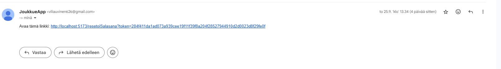

https://ilmoittautumisapp.onrender.com/

Sovelluksen frontend on toteutettu reactilla ja backend mariaDB:llä, joka hostataan filessio:ssa.

Sovelluksen inspiraationa toimii Nimenhuuto niminen sovellus, joita esim. urheiluseurat käyttävät pelaajien ilmoittautumiseen harjoituksiin tai peleihin.

Toiminnallisuudet (kaikille):

- käyttäjän rekisteröinti
- Uuden joukkueen luominen
- Liittymislinkin tekeminen, joka voidaan jakaa ihmiselle kenet halutaan joukkueeseen.
- tapahtumien lukeminen ja osallistuminen
- sähköpostin/salasanan muuttaminen
- nimen vaihto
- käyttäjätilin poisto

Toiminnallisuudet (ylläpitäjälle)

- kaikki edellä mainittu
- tapahtumien luominen/muokkaus/poisto
- joukkueen poisto (poistaa kaikki käyttäjät kyseisestä joukkueesta)
- yksittäisen pelaaja poisto
- joukkueen nimen tai kuvauksen päivittäminen
- joukkueen logon päivittäminen

Sovelluksessa on myös "unohditko salasanan" toiminto joka pyytää käyttäjää syöttämään sähköpostiosoitteensa, se on ainut asia mikä ei toimi, koska renderin ilmainen ympäristö ei salli uloslähteviä SMTP-yhteyksiä. Käytän nodemaileria sähköpostien lähettämiseen niin se tarvitsit sellaisen. Localissa testattu toimivaksi.
.

Joukkueessa "PoU edustus" on eniten testidataa jos haluaa luoda tunnuksen.
Jos käyttäjä luo itse uuden joukkueen niin hänestä tulee automaattisesti ylläpitäjä, joten ylläpitäjän toimintoja pääsee testaamaan siten.

[Tuntikirjanpito](tuntikirjanpito.txt)
